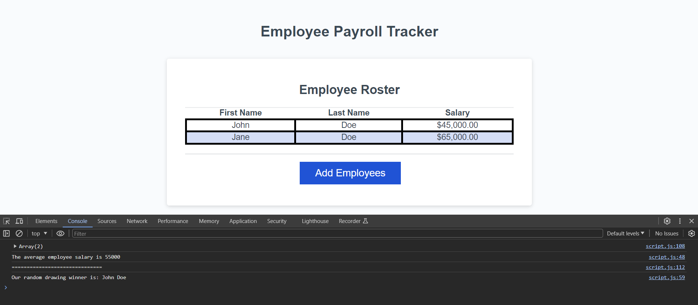

<h1>Employee Payroll Tracker</h1>

<h2>Description</h2>

The Employee Payroll Tracker is a web application that enables users to add employee names and salaries. Users can input multiple employees' information, view the displayed list of employees, and see the average salary of all employees added.

The modified code added first creates a function called collectEmployess that utilizes a while loop to prompt the user for the data of the employee (requesting first name, last name, and employee's salary) and displays the collected data.

The second displayAverageSalary function utilizes the reduce function adding all the salaries together and dividing it by the number of employees to display the average salary within the console.

The third function getRandomEmployee will create and use the array of employees previously along with the .floor and .random functions to randomly return a randomly selected employee within the console logs.

<h2>Features</h2>

Add multiple employees with their first name, last name, and salary.

Display the list of employees with their information.

Calculate and display the average salary of all employees.

<h2>Technologies Used</h2>

HTML

CSS

JavaScript

<h2>How to Use</h2>

Enter the first name, last name, and salary of an employee in the input fields.

Click the "Add Employee" button to add the employee to the list.

Repeat steps 1 and 2 to add more employees.

View the list of employees displayed on the webpage.

The average salary of all employees will be shown within the console log.

<h2>Screenshots</h2>

<h2>Deployment</h2>

The application is deployed at https://wabreu738.github.io/employee-payroll-tracker/

